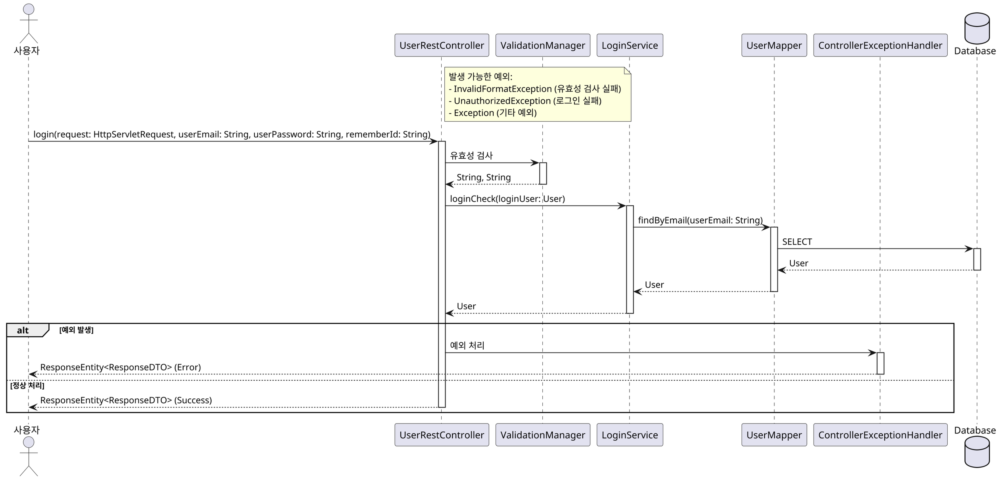
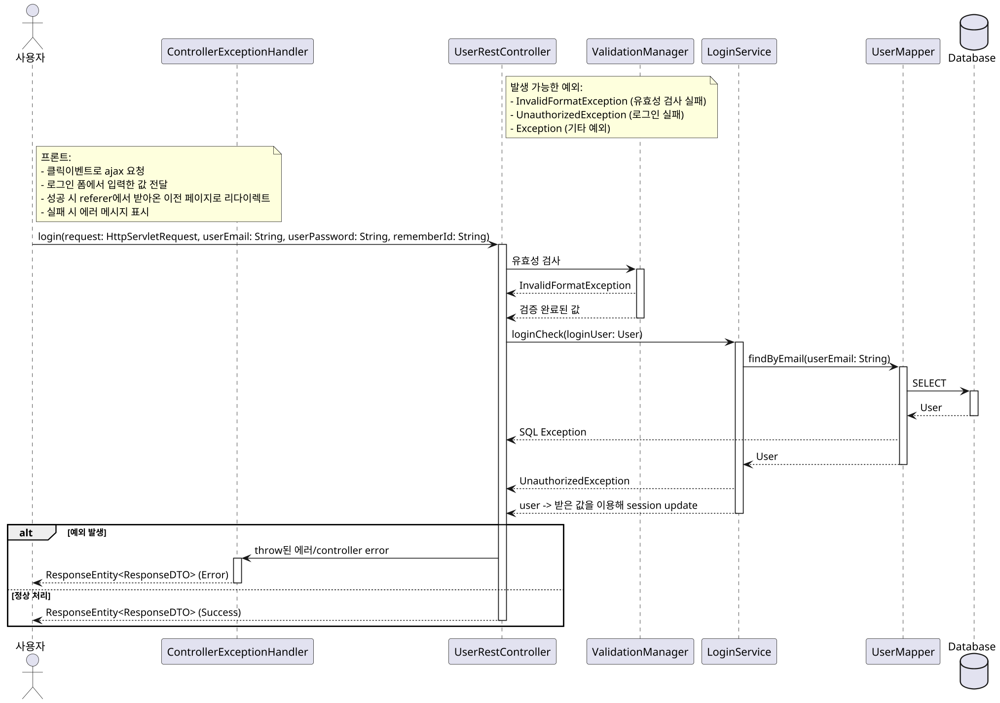

# 📌 0. 보스 클론코딩 프로젝트
### 📌 0-1. 시퀀스 다이어그램
- 시퀀스 다이어그램은 UML(Unified Modeling Language) 표준 중 하나로, 시스템 내에서 객체(또는 컴포넌트)들 사이의 상호작용과 메시지 흐름을 시간의 흐름에 따라 순차적으로 시각화한 것이다.
- 이 시퀀스 다이어그램을 우리 프로젝트에 대해 그리기 위해 해당 시퀀스 다이어그램(Sequence Diagram) 문법을 공부한다.
- Lifeline: Lifeline은 네모와 점선으로 이루어져 있으며 네모가 객체의 관점으로 표현했다면 클래스이고 서비스 관점으로 표현했으면 컴포넌트가 된다. 점선은 시간의 경과를 나타낸다.
- Activation: Activation은 Lifeline의 인스턴스가 다른 인스턴스와 상호 작용을 하며 활성화 되어 있는 것을 나타낸다. Activation은 직사각형의 막대로 Lifeline의 점선 가운데에 표시한다.
- 동기 메시지: 동기 메시지는 실선과 꽉 찬 화살표로 표현을 한다. 동기 메시지 이므로 요청을 보낸 후, 결과가 올 때까지 기다린다.
- 비동기 메시지: 비동기 메시지는 실선과 선으로 이뤄진 화살표로 표현을 한다. 비동기 메시지이므로 요청을 보낸 후, 결과를 기다리지 않는다.
- 자체 메시지: 자체적으로 작업을 처리할 때, 자체 메시지를 사용한다. 자체 메시지는 본인의 Lifeline으로 회귀하는 화살표를 그린다.
- 반환 메시지: 동기 메시지에서 표현했던 것과 같이 요청에 대한 결과를 반환한다. 점선과 선으로 이뤄진 화살표로 표현한다.
- Guard: Guard는 단일 메시지에 대해 조건을 명시할 수 있는 방법이다. 사용법은 메시지의 앞 쪽에 [ ] 대괄호로 감싼 후 조건을 명시한다. 예를 들어, 가격이 10,000원 이상이라고 하면 [price > 10000]이라고 명시한다.
- Sequence Fragment: 범위로 조건을 명시할 수 있다. 특정 부분에 대해서 메시지를 반복하거나 조건을 명시할 때 사용된다.
- alternative: alternative는 alt로 줄여서 사용한다. alt는 조건문인 if/else문을 Guard를 사용해 표현할 수 있다. alt 박스로 감싸서 if/else 두가지 경우를 표현
- option: option은 opt로 줄여서 사용한다. opt는 조건문인 if문을 Guard를 사용해 표현할 수 있다. 즉, 조건에 따라 선택 사항이 단 한 개일 경우에 사용된다. 만약 조건을 만족하지 않으면 실행하지 않는다.
- 즉 Guard는 'A라면 B한다.' 와 같이 1개에 대해 1가지의 결과를 보여주는 반면, opt는 'A라면 B도 하고 C도 하고 D도 하고 등등을 한다.' 와 같이 1개에 대해 여러 결과를 나타낼 수 있다.
- loop: loop은 단어 의미 그대로 for, while과 같은 반복문을 표현한다.
- parallel: parallel은 단어 그대로 병렬 처리를 의미한다.
- 예시로 ai가 작성한 login 메서드의 시퀀스 다이어그램을 보고 정리해보도록 하겠다.

- @startuml ~ @enduml은 PlantUML 시퀀스 다이어그램의 시작과 끝을 나타낸다.
- skinparam dpi 200 : 다이어그램 해상도(DPI) 설정한다. 이미지로 내보낼 때 선명도를 조정한다.
- actor Actor as "사용자" : Actor라는 식별자에 한글명칭 "사용자"를 붙인다. 실제로는 actor User, actor Admin 등으로도 많이 쓴다.
- 프로세스에 참여하는 내부 컴포넌트: participant 키워드로 선언하며, 이름은 실제 자바 클래스명과 맞추는 게 맞다. 예) participant UserRestController, participant ValidationManager..
- database Database: 데이터베이스를 특수 아이콘(Cylinder)으로 나타낸다.
```plantuml
skinparam dpi 200

actor Actor as "사용자"
participant UserRestController
participant ValidationManager
participant LoginService
participant UserMapper
participant ControllerExceptionHandler
database Database
```
- note right of UserRestController: UserRestController 오른쪽에 **노트(설명 박스)**를 추가한다.
- ->는 동기 호출을 의미한다. 
- : 뒤에 호출 함수명 및 파라미터 표기한다.
- Actor -> UserRestController: login(...)
- activate UserRestController: **해당 객체의 활성화(실행 중)**를 시각적으로 강조한다.
- UserRestController -> ValidationManager: 유효성 검사
- -->: "되돌아오는 반환" 화살표 (-->)
- deactivate: 활성화 해제
```plantuml
UserRestController -> LoginService: loginCheck(loginUser: User)
activate LoginService
LoginService -> UserMapper: findByEmail(userEmail: String)
activate UserMapper
UserMapper -> Database: SELECT
activate Database
Database --> UserMapper: User
deactivate Database
UserMapper --> LoginService: User
deactivate UserMapper
LoginService --> UserRestController: User
deactivate LoginService
```
- alt 예외 발생 그리고 if문에 해당되는 내용을 작성
- else 정상 처리: 정상처리 내용해 해당하는 구문 작성
```plantuml
alt 예외 발생
    UserRestController -> ControllerExceptionHandler: 예외 처리
    activate ControllerExceptionHandler
    ControllerExceptionHandler --> Actor: ResponseEntity<ResponseDTO> (Error)
    deactivate ControllerExceptionHandler
else 정상 처리
    UserRestController --> Actor: ResponseEntity<ResponseDTO> (Success)
    deactivate UserRestController
end
```

### 📌 0-2. 최종 시퀀스 다이어그램 틀
- 에러는 컨트롤러에 토스하도록 설계를 해서 모든 에러는 일단 컨트롤러로 토스하면 되고 컨트롤러, 서비스, 매퍼에서 하나의 선만 만들어서 거기에 설명으로 가능한 에러들을 나열하고 컨트롤러로 토스하도록(요청하도록 설계)
- 마지막에 모든 에러는 이 사진처럼 컨트롤러가 대표해서 핸들러에 던지고 핸들러는 에러 객체를 사용자에게 반환한다.
